# ChatConnect 

<br><hr>
# Please Download the project to use and Run it in any code editor you like. No need to signup or login. Directly head to the dashboard/adminpanel.html to create chtbot in your local system. Sorry for the inconvenience.

<br><hr>

We are team ChatConnect. This is a Final Year project at Rajiv Gandhi College of Engineering Research and Technology, Chandrapur, Maharashtra.
This is a open source project, which helps user to create simple conversational chatbot using JSON format. We would love to welcome contributions from
peers worldwide to make this project more secure, reliable, advanced and easy to use.


Below are the details about the project.


# How to use this project?

Let's not make it complex from the very start. We will divide it into steps as follows:

- Go to <a href="https://chatconnect.io.in"> our official webiste</a> first.
- Explore the website for your how's and what 🤔.
- Here you can have a demo of chatbot , you will be getting after all procedure. Window is popped-up when you load the website.
- Now head towards <a href="https://chatconnect.io.in/sign-up.html"> signup/login</a> feature.
- Signup and then login to get access to our admin panel. 🛠️

That's it for this section. Next steps on how to use admin panel.....

<hr>


# How to use admin panel for creating the chatbot?

So once you did all necessary steps from the above section. Well, you are now good to go for next steps 🥳.

- To use admin panel , you need to be logged in.
- You will be automatically, redireted to profile section of dashboard. ➡️
  - Here you can see following type of boxes to be filled.<br><br>
    <br><br>
  - Main purpose of these fields is to gather the business details 🔂 of the user, who is going to make the chatbot 📇. If any user don't have any business (🧑🏽‍)💼 and is a student (🧑🏾‍💻) then he can add college details or project details accordingly.
  - This gathering of details is all about the future enhancements in the project for business profile section..🔜
  - Here the first section is <b>Business Details</b> and other one is <b>Business User Role</b>, what does it define?<br><br>
   <table>
    <tr>
      <th>Business Details</th>
      <th>Business User Role</th>
    </tr>
    <tr>
      <td>This section defines details of the business or project the user is going to integrate this chatbot on.</td>
      <td>This section defines the person who is going to build and handle this chatbot on behalf of business or project as admin or employee.</td>
    </tr>
   </table>
  
<hr>
  
# Now let's go to next section <b>Information</b> 📌<br>
  - In this section , all the necessary steps are explained with the help of steps, as follows...<br>
    ▶ Quick links for quick navigation, at the top of the section. <br>
    ▶ Steps to enter data for chatbot in JSON format. <br>
    ▶ Explanation about each terms included JSON format, for easy understanding. <br><br>
    <br><br>
    ▶ Again for better understanding and live genration and integration of chatbot , please see this [Live Demo](#)<br>
    
<hr>
  
# Now move to next section <b>Generate</b> 📌<br>
  - In this section you will find a Notepad like editor, where you have to follow below steps.<br>
    ▶ Start writing the data for chatbot, as displayed on **example template** in **Information Section**. <br>
    ▶ For simple generation, you can use our **pre-designed JSON data template**. Copy and Paste it in editor and start editing accordingly.<br>
    ▶ To copy and edit the demo data file, [Copy & Paste Me](https://github.com/Rutikab12/Chatbot-Web-Application/blob/main/demo-data/data.json)<br>
    ▶ After writing data, follow screenshots you see below<br><br>
    <table>
    <tr>
      <th>Step-1: Copy the sample data from GitHub.</th>
      <th>Step-2: Paste the data in editor, given in admin panel.</th>
    </tr>
    <tr>
      <td>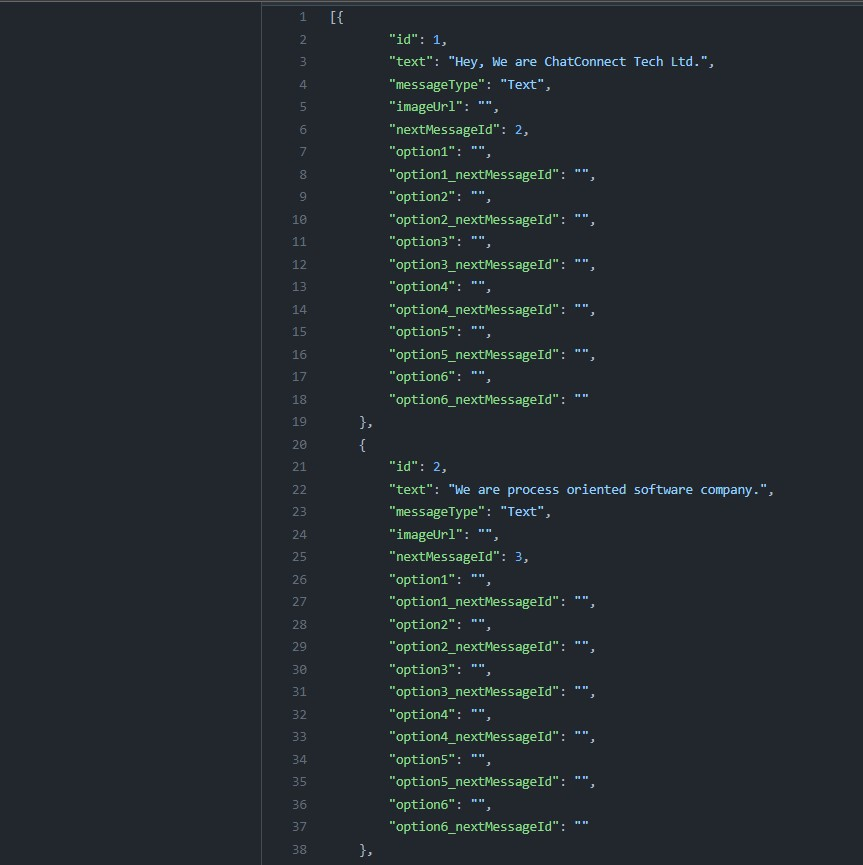</td>
      <td>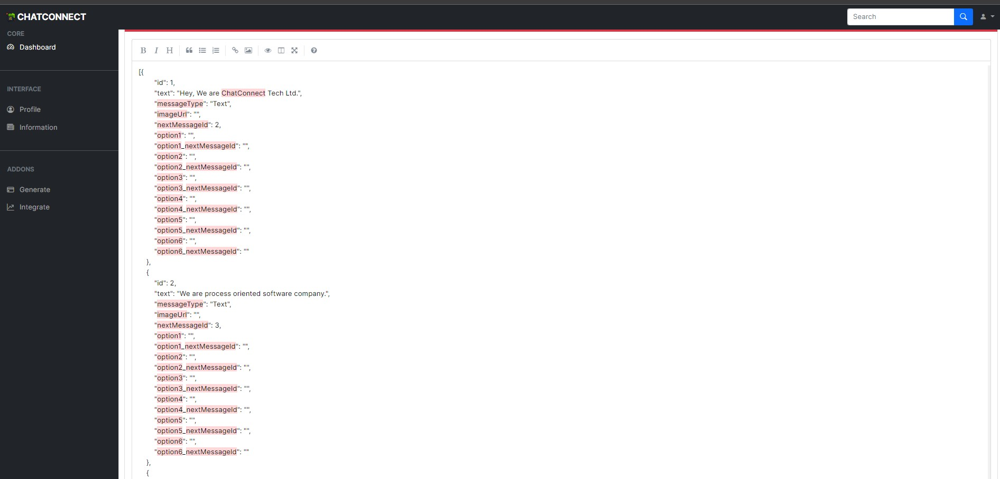</td>
    </tr>
    <tr>
      <th>Step-3: Edit the data according to your need.</th>
      <th>Step-4: Copy all the edited data, Open Notepad and paste the data.</th>
    </tr>
    <tr>
      <td></td>
      <td>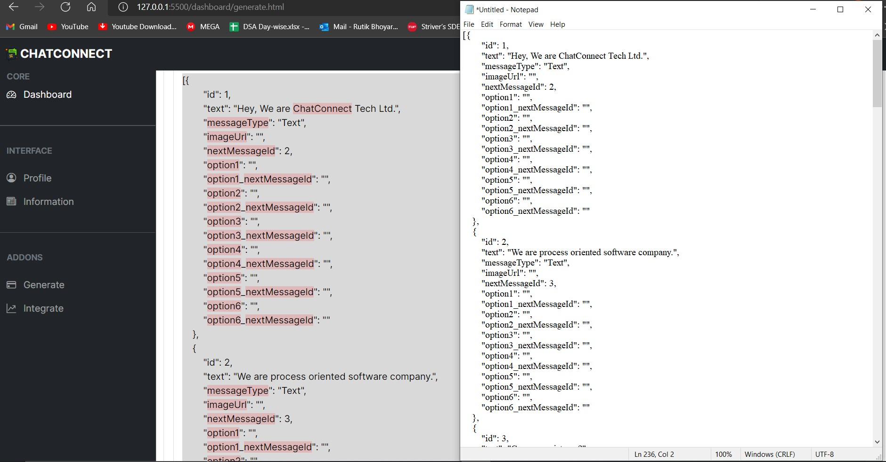</td>
    </tr>
    <tr>
      <th>Step-5: Save the file as data.json</th>
      <th>Step-6: Now the next step is integration</th>
    </tr>
    <tr>
      <td>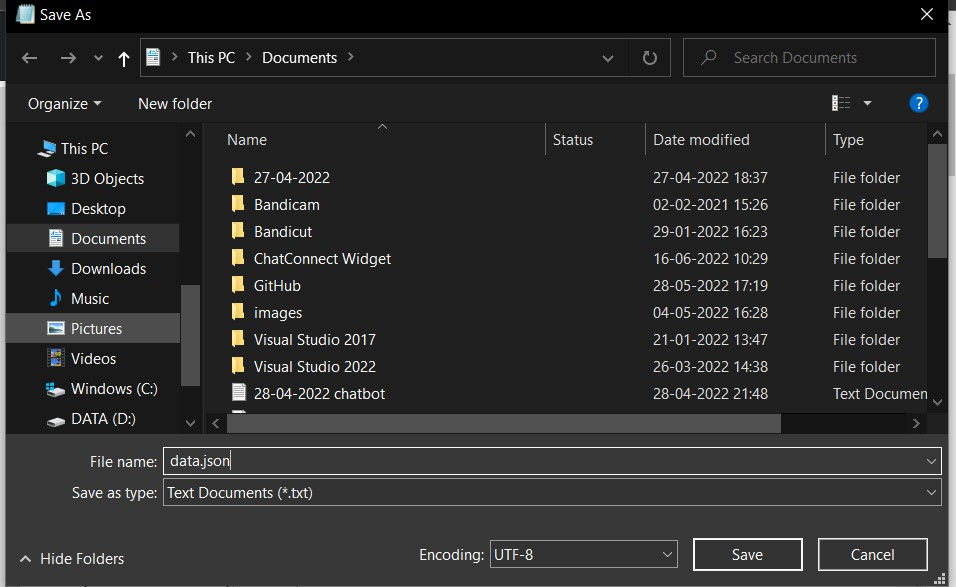</td>
      <td></td>
    </tr>
    </table>

<hr>

# Now let's integrate the chatbot on the website, **Integrate Section** 📌<br>
  <table>
  <tr>
    <th>Step-1: Download Zip Folder from here.</th>
    <th>Step-2: Unzip it, and paste the two folders **demo-data** and **src** in your project folder.</th>
  </tr>
  <tr>
    <td>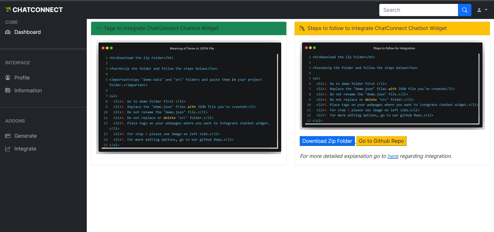</td>
    <td>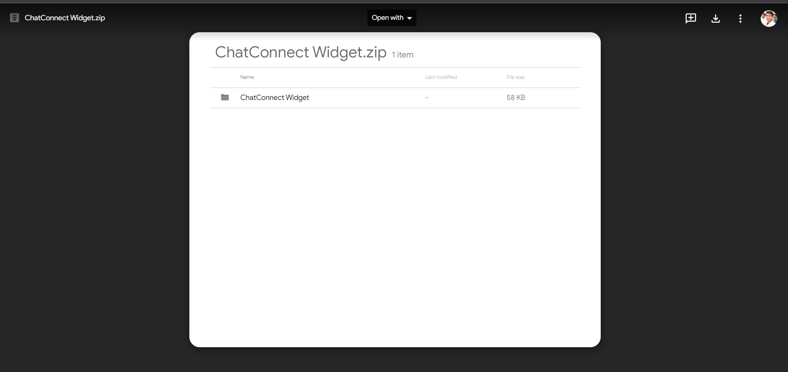</td>
  </tr>
  <tr>
    <th>Step-2: Unzip it, and paste the two folders **demo-data** and **src** in your project folder.</th>
    <th>Step-3: Copy the **demo** and **src** folder.</th>
  </tr>
  <tr>
    <td></td>
    <td>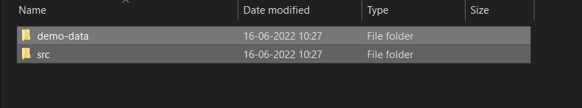</td>
  </tr>
  <tr>
    <th>Step-4: Paste those two folder in project folder.</th>
    <th>Step-5: Now copy the **data.json** file and paste in inside **demo-data** folder.</th>
  </tr>
  <tr>
    <td>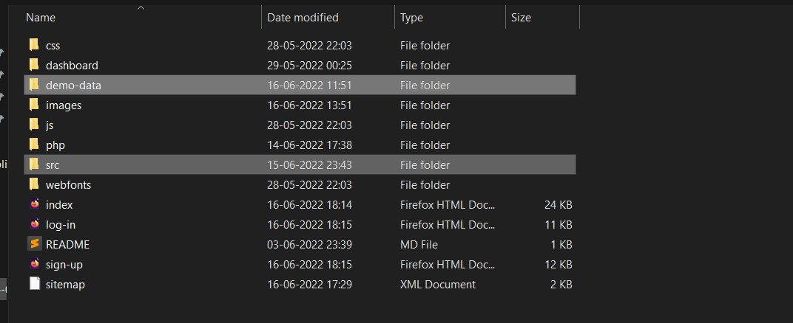</td>
    <td>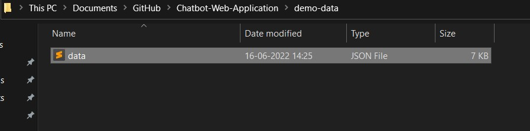</td>
  </tr> 
  <tr>
    <th>Step-6: Now copy link tags,paste it inside <head> tag of the page, where you want to integrate chatbot widget.</th>
    <th>Step-7: Now copy script tags,paste it inside <body> tag of the page, where you want to integrate chatbot widget.</th>
  </tr>
  <tr>
     <td>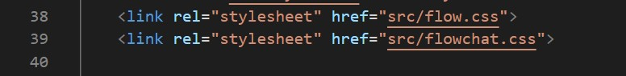</td>
     <td>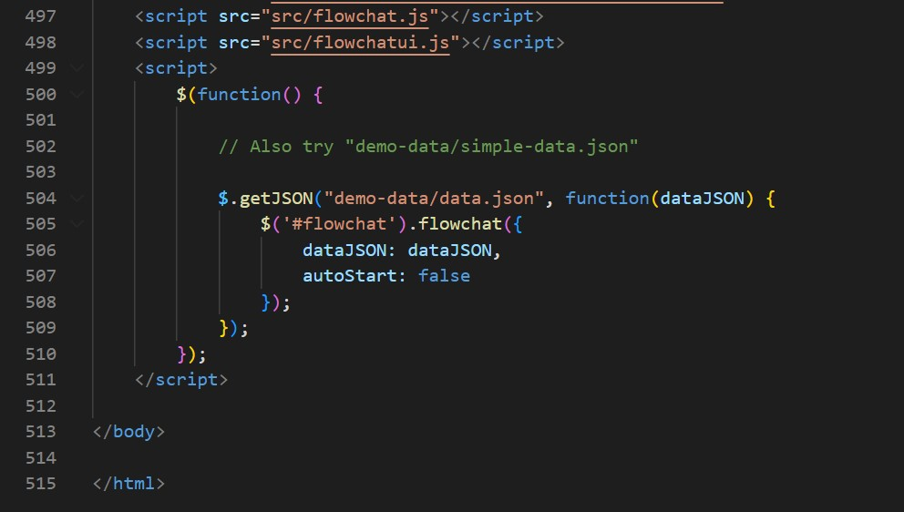</td>
  </tr>
  <tr>
    <th>Step-8: Now refresh & run the page where you have place the above tags.</th>
  </tr>
  <tr>
    <td>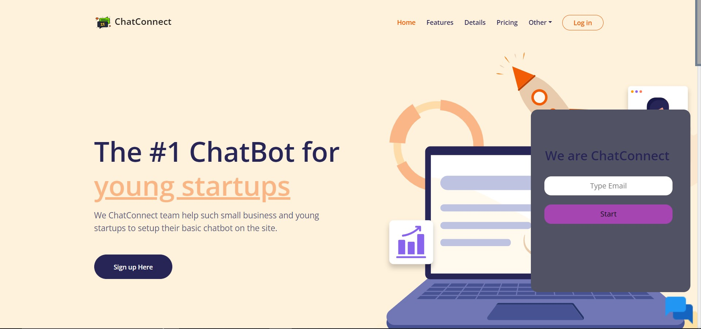</td>
    
  </tr>
  </table>
  <br><br> 
  
<hr>

```
<link rel="stylesheet" href="src/flow.css">
<link rel="stylesheet" href="src/flowchat.css">
```

<br>

```
<script src="src/flowchat.js"></script>
<script src="src/flowchatui.js"></script>
<script>
        $(function() {

            $.getJSON("demo-data/data.json", function(dataJSON) {
                $('#flowchat').flowchat({
                    dataJSON: dataJSON,
                    autoStart: false
                });
            });
        });
</script>
```

<hr>

# Tech Stack Behind this Project
- HTML,CSS, Bootstrap
- JavaScript, jQuery
- PHP,etc.

<hr>


# People Behind this Project
🧑🏼‍💻 **Rutik Bhoyar** | [LinkedIn](https://www.linkedin.com/in/rutik-bhoyar-5b67341b0/) <br>
🧑🏼‍💻 **Pranay Haramwar** | <br>
🧑🏼‍💻 **Dipak Vaidya** | <br>
🧑🏼‍💻 **Yogesh Dongarwar** | <br>

# Future Scope
🔓 Make it available for open source contributors. <br>
🔓 Secure backend modules, Database and additon of authentication and authorization. <br>
🔓 Enhance UI of product website.<br>
🔓 Enhance UI of Chatbot. <br>
🔓 Validation of data inserted for chatbot.<br>
🔓 Admin Dashboard validation and UI enhancements.

<hr>

**Note: All images,cdn,required libraries used in this project are open-sourced and do not violate their terms and regulations** <br>

# Thank You !
    


